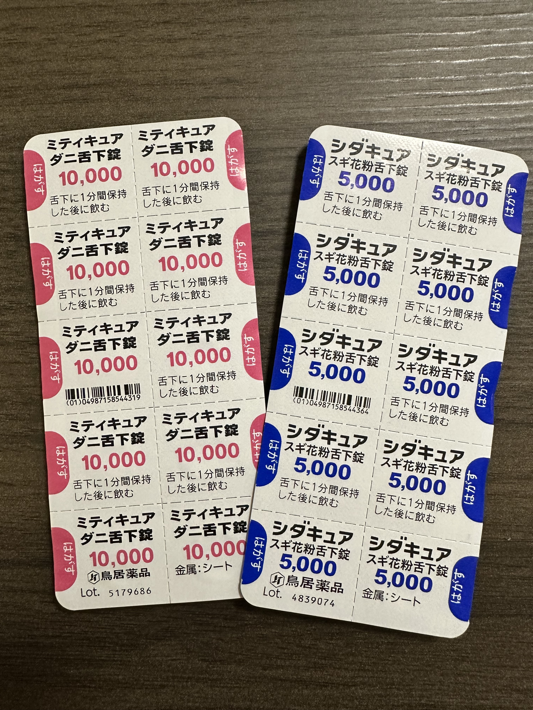

舌下免疫療法を始めて4年が経ったので経過を振り返る。

<!--more-->

## 前回記事
[舌下免疫療法を始めて20ヶ月が経った]()

## 過去2シーズン
なんだかんだで毎シーズン抗ヒスタミン剤を処方してもらっている。というのも3月頃からGW明け頃まで普通に鼻水が酷いのである。

### 2月
大体世の中で花粉の症状が出始める2月頃は平気。


今年も大体2月中旬からスギが飛び始め2月末にピーク入りを観測していても症状はほぼ出ていなかった。  
[花粉週間　今週末から来週にかけて大量飛散も　スギ花粉ピーク期近づく　万全な対策を](https://tenki.jp/forecaster/gureweather/2023/02/22/21991.html)

### 3月
3月上旬の過去10年最多のスギ花粉もほぼ症状はなかった。


ではなぜ3月頃(今年は3月中旬以降)から症状が酷くなるのかというと、そう、ヒノキ花粉である。

[2023年シーズン　スギ／ヒノキ花粉の飛散量（速報）～過去３年で最も多い飛散を観測、東京は４月末で終了見込み～](https://www.jwa.or.jp/news/2023/04/20224/)

今年は3月中旬からGW明け頃まで鼻水がひどかったので丁度ヒノキ花粉の飛散時期と一致している。

## 4年経ってみて

### スギ花粉舌下錠
今シーズンはスギ花粉が過去10年最多だったらしいがヒノキ花粉が飛び始めるまでは症状が出なかったので着実に効果は出ていると思われる。

### ダニ舌下錠
花粉シーズンだと室内で花粉なのかダニなのか分からないが花粉シーズン以外だとほぼ症状は無いので効果が出ていると思われる。

### まとめ
来シーズンにヒノキ花粉が落ち着いていればスギ花粉舌下錠の効果の度合いが分かりそうなのでもう1年服用を頑張ろうと思います。3~5年の服用期間が推奨とのことなので5年経ったら一度検査を受けるなり病院で相談してみようと思います。
