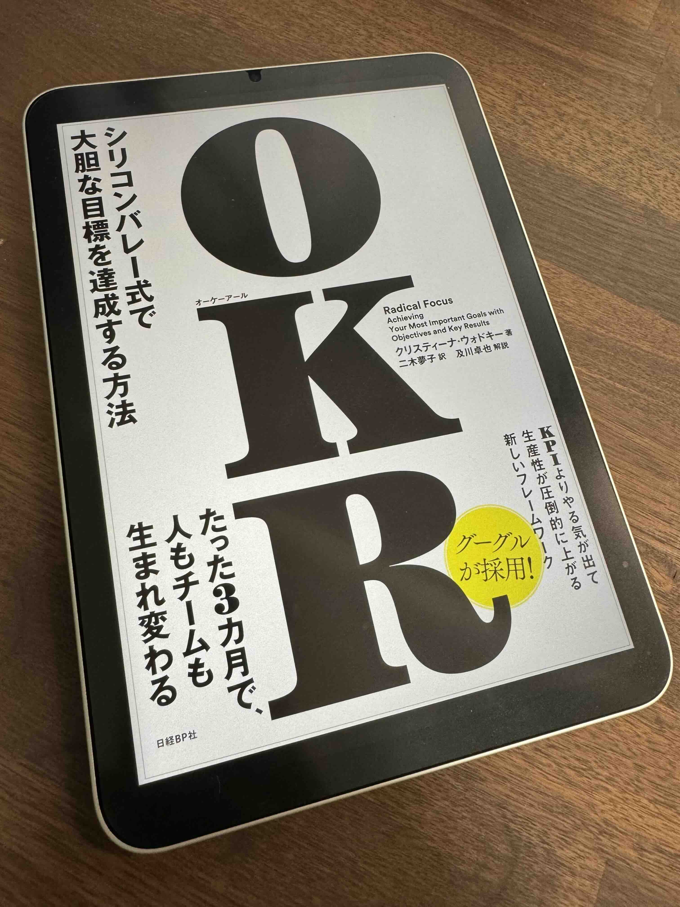

目標達成の手法を知りたくて「OKR」を読みました。

<!--more-->

## 感想
第一部では物語ベースでスタートアップの創業者がOKRを導入しながら企業を成長させていく内容、後半の第2部では具体的な実践方法など、解説のような構成になっていて理解しやすかったです。
丁度年始のタイミングなので早速今年(四半期)の個人目標をOKRで実践してみたくなりました。
まだ理解しきれていない部分もあるので本書で触れられている[GoogleのOKR手法](https://rework.withgoogle.com/jp/guides/set-goals-with-okrs#introduction)や別の本も読んで理解を深めて目標達成の手法を勉強したくなりました。

## メモ
- OKRはObjectives and Key Results(目標と主な結果)の略
- OKRは達成できるかできないか半々くらいのものが良い
    - 達成する自信度が50%の目標をストレッチ・ゴールと呼ぶ
    - 低すぎる目標はサンドバッグと呼ぶ
- OKRの確認、週ごとのやるべきことを毎週MTGでチェックする
- OKRを四半期の途中で変えてはいけない
- Oは定性的なものを一つだけ
    - GoogleのOKRではひとつではなく、３つから5つが推奨されている
    - Oは四半期の目標を設定する
- KRは定量的なものを3つくらい
    - 感覚的な言葉を定量化する(数字で表す)
    - 「どうやってOを満たしたとわかるか」というシンプルな問いを立てる
- 週の優先事項
    - P1はやらなければいけないこと、P2はやるべきこと
    - やらないとOKRを達成できないことを書く
    - ５つ以上は書かない
- 金曜日のウィンセッション
    - 各チームがその週に達成したことを見せ合う、讃える
    - お祝いの飲食物を提供するのも大切
    - "コミット"と"お祝い"のメリハリがパフォーマンス向上、"実行"の習慣に繋がる
