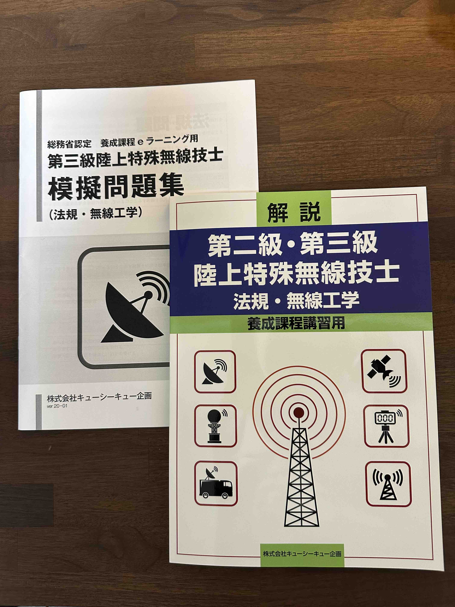
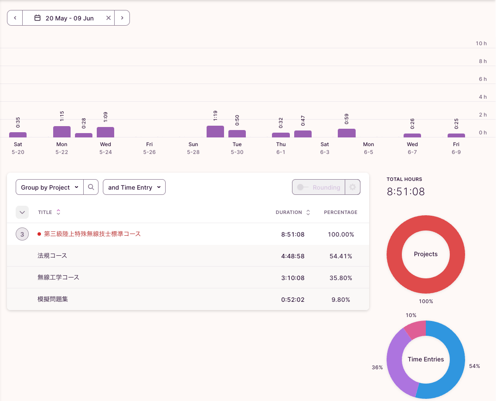
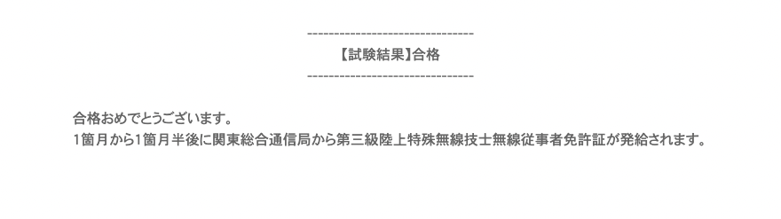

<!--more-->
6月10日に「第三級陸上特殊無線技士」の修了試験を受けたのでメモ。

## 動機
資格の取得で大学の単位認定がされ、割りと取得難易度が低いようだったので取得することにしました。

## 陸上特殊無線技士とは
電波法令で定める無線従事者資格のひとつで、陸上の無線局の技術的な操作するために必要な資格です。  
無線従事者の資格を取得するには、次の４つの方法があります。

> 1. 国家試験に合格する
> 1. 養成課程(かてい)を修了する
> 1. 学校で無線通信に関する科目を修めて卒業する
> 1. 一定の資格・業務経歴を得る

[総務省 電波利用ホームページ - 無線従事者資格の取得方法](https://www.tele.soumu.go.jp/j/sys/operator/acquest/index.htm)

## 勉強方法
調べてみると「養成課程を修了する」方法で取っている人が散見され、かつ難易度が低いようだったのでこの方法を選びました。

### 養成課程
養成課程は[QCQ企画のeラーニング形式](https://www.qcq.co.jp/ykk/tkg/tkg_e.html)に申し込みしました。

eラーニング形式以外にも講習会形式(一日で受講から修了試験まで完結)もありましたが、日程の融通が利くeラーニング形式にしました。

学習内容は法規コース、無線工学コースを順番にそれぞれ

1. 動画視聴(10~20分)
1. 小テスト
1. 全問正解で次の動画へ

を繰り返して学習しました。

学習時間は30分~1時間/日、計9時間弱を3週間程度かけての学習でした。

eラーニングの最後に無線工学の判定試験があり、合格するとCBT-Solutionsによる修了試験申込のためのチケットが発行されます。
CBT-Solutionsの受験者専用サイトから試験会場と日時を選んで発行された受験チケットのコードを入力して申し込みしました。

テキストとは別に模擬問題集があったのでコースを終えたあとに解いて復習しました。

## 修了試験
修了試験は法規と無線工学が択一式で10問ずつ、どちらも6門以上の正解で合格です。
問題はほぼ模擬問題集の内容だったので10分程度で終わってしまいました。

結果は翌日にCBT-Solutionsのマイページから確認でき、無事合格でした。

1ヶ月半程度で免許証が送られてくるとのこと。
