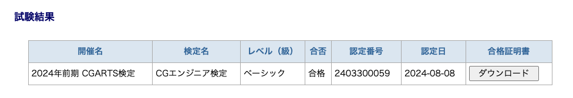
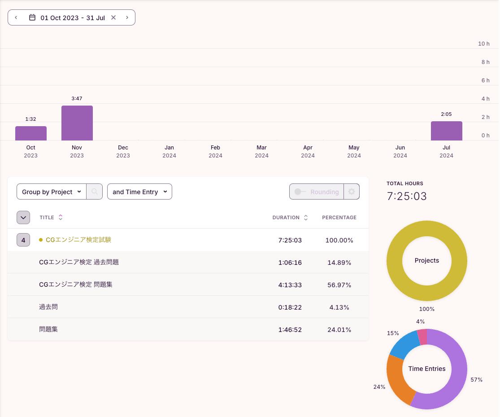

<!--more-->
7月に「CGエンジニア検定 ベーシック」を受けたのでメモ。

## 動機
以下と同じで取得すると大学の単位認定されるので受けてきました。


試験自体は去年に一度受けてたが見事に不合格だったので2度目の受験となりました。

## CGエンジニア検定とは
[CG-ARTS検定 CGエンジニア検定](https://www.cgarts.or.jp/v1/kentei/about/cg_engineer/index.html)には以下のようにあります。
> CG分野　の開発や設計を行うエンジニア、プログラマのための検定

検定にはエキスパートとベーシックの2種類があり、大学の単位認定ではどちらをとっても同じ単位だったため難易度的にベーシックを受験しました。

試験の概要は以下の通り。
- 試験形式
  - マークシート
- 問題数
  - 10問
- 試験時間
  - 60分
- 合格点数
  - 70点以上(100点満点)

問題数は10問とありますが1問に小問が4問あり、計40問ありました。尚、配点は非公表のようです。[FAQ - 個人受験者](https://www.cgarts.or.jp/v1/kentei/faq/personal.html)

## 結果
タイトルの通り、無事合格でした。

解答速報は3日以降に発表されていたので自己採点したところ丁度70%でした。配点次第では危ういかと思ってましたが、ギリギリ合格することができました。

合格通知と合格証の発送は試験から2ヶ月後の予定とのことなので来月あたりに届くようです。

## 勉強方法
公式の問題集で勉強しました。  
[CGエンジニア検定エキスパート・ベーシック公式問題集[改訂第三版]](https://amzn.asia/d/56sOSsg)

僕は去年一度受験しているため第三版を使って勉強しましたが、2024/3に第四版が出ていてエキスパートとベーシックが分かれているのでこれから受験する方は第四版を利用するのが良いと思います。[^1]  
[CGエンジニア検定ベーシック公式問題集 [第四版]](https://www.cgarts.or.jp/books_detail/wbbce_4/)
[^1]: 執筆時amazonでは定価の新品は販売されてませんでした。

学習時間は1回目の受験時と合わせて7時間半程度でした。

過去問も少しやりましたが、解答の解説はないので問題の傾向を掴むのと、問題集と類似問題を照らし合わせる程度でした。  
また、第1問は共通問題で知的財産権に関する問題が必ず出るため重点的に読みました。

2回目の受験時は1週間で1日20分程度、問題集の復習を1周する程度だったのでもう1周すれば余裕もって合格できたかな、という感想です。
