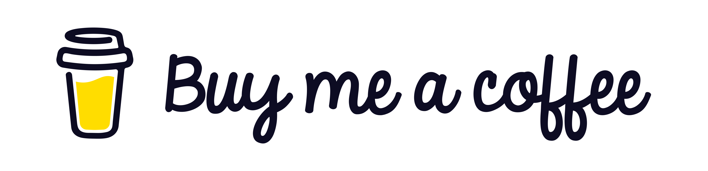
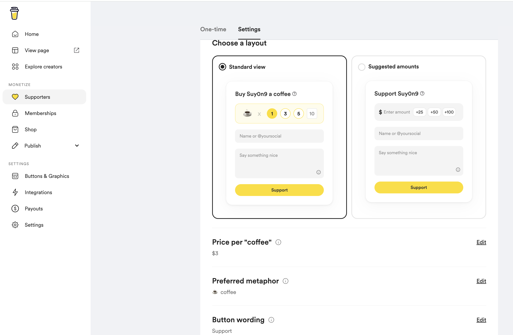
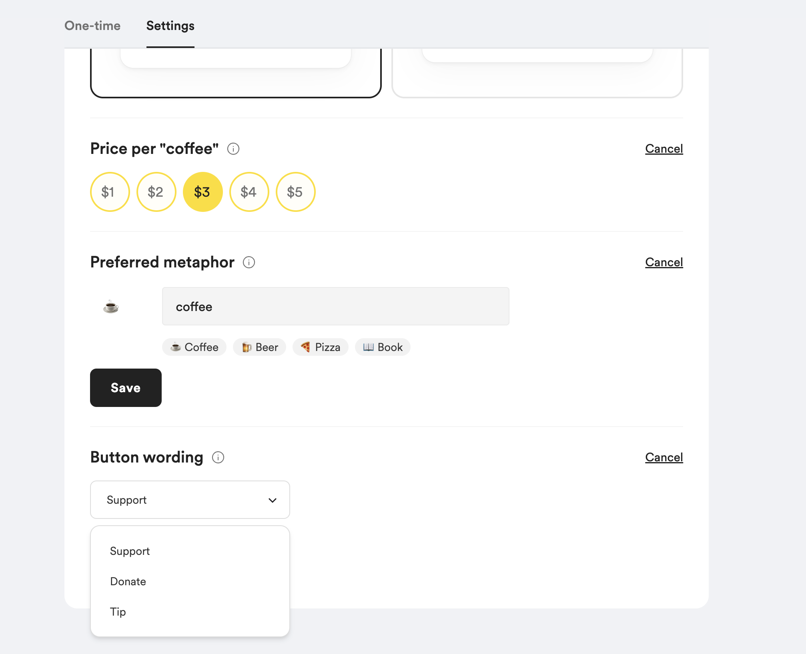
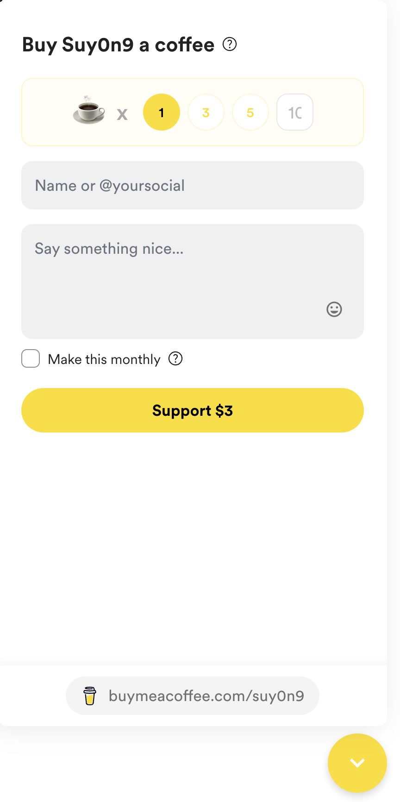

先日久々にブログテーマ[^1]のバージョンアップデートをした際に、新機能はあるかとドキュメントを眺めていたら[Buy Me a Coffee](https://www.buymeacoffee.com/)のparameterがあったので設置してみた。

<!--more-->

## Buy Me a Coffeeとは

ざっくりいうとコーヒーを一杯奢る感覚でクリエイターを支援する投げ銭サービスです。日本だとnoteやzenn.devなどがブログとしての投げ銭機能を提供していて有名ですが、Buy Me a Coffeeは専用のサービスとして提供されてるので、ブログに限らず専用ページのリンクやボタン、ウィジェット設置で投げ銭を受け取ることができます。

## 設置方法
まずはBuy Me a Coffeeのアカウントを作成し、支援を受け取るためのページを作成します。以前は受取口座の連携としてPayPalやPayoneerなどが選択できたみたいですが[^2]、現在はStripeのみ選択可能のようです。

そのため、事前にStripeのアカウントを作成しておく必要がありました。

Buy Me a Coffeeのページを作成したら、Supporters > Settingsに移動し、ウィジェットの設定を行います。


アカウント作成時にはSuggested amountsレイアウトが設定されていますが、これを変更することもできます。僕はStanderd Viewに変更しました。

Standard viewでは金額やmetaphor、Button Wordingを変更することが来ます。



次に、Hugoの`config/_default/params.toml`に以下のように設定を追加します。

```toml
[buymeacoffee]
identifier = "suy0n9" # Buy Me a CoffeeのユーザーID
globalWidget = true
globalWidgetColor = "#FFDD00"
globalWidgetPosition = "Right"
```

設定を反映すると以下のようにウィジェットが表示されます。


## おわりに
導入自体はBlowfishのお陰で簡単でしたが、アカウント作成するためにStripeのアカウントを作成する必要があったのが少し面倒でした。

投げ銭機能としては支援を「コーヒーを一杯奢る」というのに例えたコンセプトが面白いのとnoteやzenn.devなどのプラットフォームに依存しないので、HugoやWordPressなどでブログを構築している方には良いかもしれません。

いいねと思ったら試してみてもらえると嬉しいです。普段は朝に一杯だけですが、午後のご褒美コーヒーにします。


[^1]: このブログはHugoの[Blowfish](https://blowfish.page/)テーマを使って構築しています

[^2]: 
    - [PayPal no longer supported through Buy Me a Coffee](https://buymeacoffee.com/kingdomkeys/paypal-longer-supported-buy-me-coffee)
    - [Payoneer No More: New Changes at BMC](https://buymeacoffee.com/filipinomagick/payoneer-no-more-new-changes-bmc)
